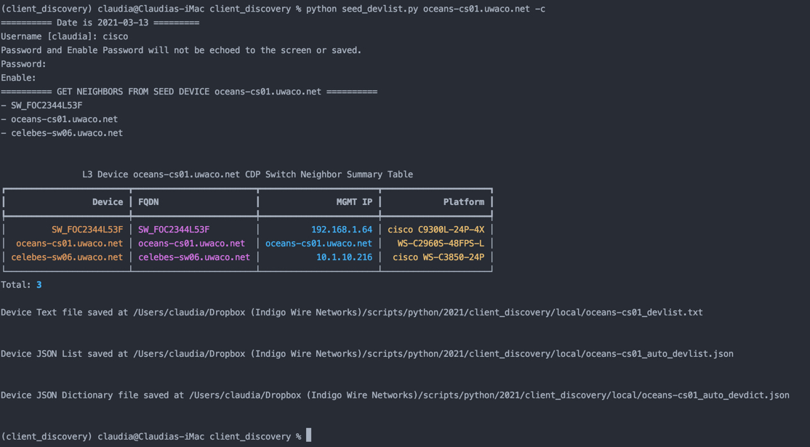

# Client Discovery Utilities


## Synopsis

Commonly used Netmiko utilities for client discovery.


## Installation

1. Install Python (version 3.12)
2. Clone or Download this repository
3. Define a virtual environment
4. Activate your virtual environment
5. Install the required Python Modules for this repository

---

Tip: Using 'uv` simplifies the creation, use, and management of Python virtual environments.` This repository supports both uv as well as the more traditional convention of running python scripts.

If you are new to `uv` and would like a brief introduction, see:
[Ultra Valuable uv for Dynamic, On-Demand Python Virtual Environments](https://gratuitous-arp.net/dynamic-on-demand-python-venv-or-virtual-environments/)

------


##### 1 - Install Python

- Mac
  - Install with [HomeBrew](https://programwithus.com/learn/python/install-python3-mac)
- Windows
  - [Download Python 3.12.4](https://www.python.org/downloads/)

##### 2 - Clone this repository

- Go to the [repository on GitHub](https://github.com/eianow-automation/eia_cisco_client_discovery) and click the Code button.


- Select a location on your system for the clone or download.

```
claudia@Claudias-iMac ~ % cd  Clones
claudia@Claudias-iMac Clones % pwd
/Users/claudia/Clones
claudia@Claudias-iMac Clones % git clone https://github.com/cldeluna/client_discovery.git
Cloning into 'client_discovery'...
remote: Enumerating objects: 30, done.
remote: Counting objects: 100% (30/30), done.
remote: Compressing objects: 100% (21/21), done.
remote: Total 30 (delta 9), reused 28 (delta 7), pack-reused 0
Unpacking objects: 100% (30/30), done.
claudia@Claudias-iMac Clones %
```


##### 3 - Define a Virtual Environment for the repo


```
claudia@Claudias-iMac client_discovery % ls -l
total 96
-rw-r--r--  1 claudia  staff  1098 Mar 13 08:53 LICENSE
-rw-r--r--  1 claudia  staff  5939 Mar 13 08:53 README.md
-rw-r--r--  1 claudia  staff  6237 Mar 13 08:53 add_2env.py
-rw-r--r--  1 claudia  staff    25 Mar 13 08:53 example_device_file.txt
-rw-r--r--  1 claudia  staff  6452 Mar 13 08:53 get_showcmds.py
drwxr-xr-x  5 claudia  staff   160 Mar 13 08:53 images
-rw-r--r--  1 claudia  staff   405 Mar 13 08:53 requirements.txt
-rw-r--r--  1 claudia  staff  1781 Mar 13 08:53 show_cmds.yml
-rw-r--r--  1 claudia  staff  4745 Mar 13 08:53 utils.py
claudia@Claudias-iMac client_discovery %
claudia@Claudias-iMac client_discovery %
claudia@Claudias-iMac client_discovery % python3 -m venv myvenv
claudia@Claudias-iMac client_discovery % ls -l
total 96
-rw-r--r--  1 claudia  staff  1098 Mar 13 08:53 LICENSE
-rw-r--r--  1 claudia  staff  5939 Mar 13 08:53 README.md
-rw-r--r--  1 claudia  staff  6237 Mar 13 08:53 add_2env.py
-rw-r--r--  1 claudia  staff    25 Mar 13 08:53 example_device_file.txt
-rw-r--r--  1 claudia  staff  6452 Mar 13 08:53 get_showcmds.py
drwxr-xr-x  5 claudia  staff   160 Mar 13 08:53 images
drwxr-xr-x  6 claudia  staff   192 Mar 13 09:01 myvenv
-rw-r--r--  1 claudia  staff   405 Mar 13 08:53 requirements.txt
-rw-r--r--  1 claudia  staff  1781 Mar 13 08:53 show_cmds.yml
-rw-r--r--  1 claudia  staff  4745 Mar 13 08:53 utils.py

```


##### 4 - Activate your virtual environment

###### Mac

```
claudia@Claudias-iMac client_discovery %
claudia@Claudias-iMac client_discovery % source ./myvenv/bin/activate
(myvenv) claudia@Claudias-iMac client_discovery %
```


##### 5 - Install the required Python Modules for this repository

With your virtual environment activated, install the requirements for this repository.

**Option 1 - Using pip**

```
(myvenv) claudia@Claudias-iMac client_discovery % pip install .
```

**Option 2 - Using uv**

```
(myvenv) claudia@Claudias-iMac client_discovery % uv pip install .
```


## Usage


#### get_showcmds.py

You can run the scripts in this repository either with standard Python or via `uv`:

- **Standard Python**: `python get_showcmds.py ...`
- **Using uv**: `uv run get_showcmds.py ...`

In its simplest form, by providing the IP or FQDN of a network device with the ***-d*** option, the script executes the associated set of show commands in the **show_cmds.yml** file on the provided device, and saves the output to a timestamped file.  The output is saved, by default,  in a directory under the current working directory named "local".  

The script has a variety of option to tailor the script execution.

The ***-o*** or ***--output_subdir*** can be used to save output in a different subdirectory.

##### Credentials

By default the script will load credentials as environment variables from a **.env** file.

The -m option (for Multi Factor Authentication) concatenate a password with an MFA code so as to minimize typing.

The script also supports an option ***-c*** or ***--credentials*** argument which interactively requests the username, password, and enable password to be used.  Passwords are not echoed back and credentials are not saved.

##### Device Types

The default device type is a Cisco IOS or IOS-XE device.

An optional device type can be provided. The default device type **cisco_ios**.

##### Executing a single show command

This script executes show commands either via a single show command provided with the ***-s***  or ***--show_cmd*** option on the CLI when the script is called or via a set of standard show commands loaded from a YAML file based on device type.

##### Executing show commands across multiple devices with the same credentials

The script can take in a list of IPs or FQDNs in a text file using the ***-f*** or ***--file_of_devs*** option.

Example:

In this example the **get_showcmds.py** file is executed with 

- The ***-c*** option so that credentials are provided via the command line interactively
- The ***-s*** option is used to only run the "show version" command
- The ***-f*** option is used to execute this against the IPs or FQDNs in the provided text file.

```
(client_discovery) claudia@Claudias-iMac client_discovery % python get_showcmds.py -c -s "show ver" -f example_device_file.txt
(client_discovery) claudia@Claudias-iMac client_discovery % uv run get_showcmds.py -c -s "show ver" -f example_device_file.txt
===== Date is 2021-03-12 ====
Username [claudia]: cisco
Password and Enable Password will not be echoed to the screen or saved.
*** These credentials will be use for all devices in the file example_device_file.txt***
Password: 
Enable: 

===============  Device 10.1.10.212 ===============
--- Show Command: show ver

Saving show command output to /Users/claudia/Dropbox (Indigo Wire Networks)/scripts/python/2021/client_discovery/local/10.1.10.212_2021-03-12.txt


===============  Device 10.1.10.216 ===============
--- Show Command: show ver

Saving show command output to /Users/claudia/Dropbox (Indigo Wire Networks)/scripts/python/2021/client_discovery/local/10.1.10.216_2021-03-12.txt


(client_discovery) claudia@Claudias-iMac client_discovery % 


```


##### Text File of Devices

```
(client_discovery) claudia@Claudias-iMac client_discovery % cat example_device_file.txt 
10.1.10.60
pacific-ds01.uwaco.net
10.1.10.66
10.1.10.67


```


#### Help

Use the -h option to see the script options.

```
(client_discovery) claudia@Claudias-iMac client_discovery % python get_showcmds.py -h
(client_discovery) claudia@Claudias-iMac client_discovery % uv run get_showcmds.py -h
usage: get_showcmds.py [-h] [-d DEVICE] [-t DEVICE_TYPE] [-p PORT] [-o OUTPUT_SUBDIR] [-s SHOW_CMD] [-n NOTE] [-m] [-c] [-f FILE_OF_DEVS]

Script Description

optional arguments:
  -h, --help            show this help message and exit
  -d DEVICE, --device DEVICE
                        Get show commands from this device (ip or FQDN) and save to file
  -t DEVICE_TYPE, --device_type DEVICE_TYPE
                        Device Types include cisco_nxos, cisco_asa, cisco_wlc Default: cisco_ios
  -p PORT, --port PORT  Port for ssh connection. Default: 22
  -o OUTPUT_SUBDIR, --output_subdir OUTPUT_SUBDIR
                        Name of output subdirectory for show command files
  -s SHOW_CMD, --show_cmd SHOW_CMD
                        Execute a single show command
  -n NOTE, --note NOTE  Short note to distinguish show commands. Ex. -pre or -post
  -m, --mfa             Multi Factor Authentication will prompt for VIP, MS Auth, Google auth, or other 2-Factor code
  -c, --credentials     Set Credentials via Command Line interactively
  -f FILE_OF_DEVS, --file_of_devs FILE_OF_DEVS
                        Provide the full path to a text file containing an IP or FQDN on each line (see example_device_file.txt) to execute show commands on multiple devices with the same credentials.

Usage: ' python get_showcmds.py -d my_switch_hostname.my.domain'
(client_discovery) claudia@Claudias-iMac client_discovery % 


```


### seed_devlist.py

Often a single source of truth is not available.  This script takes in a mandatory Layer 3 devices (collapsed core or distribution) and builds a list of the CDP switch neighbors (Cisco WS-XX) which can be provided to the get_showcmds.py script with the -f option.  The script only goes one level deep.

Note: this script requires that the [ntc-templates repository](https://github.com/networktocode/ntc-templates) be cloned into the repo.

```
(client_discovery) claudia@Claudias-iMac client_discovery % git clone https://github.com/networktocode/ntc-templates.git
Cloning into 'ntc-templates'...
remote: Enumerating objects: 9053, done.
remote: Total 9053 (delta 0), reused 0 (delta 0), pack-reused 9053
Receiving objects: 100% (9053/9053), 2.45 MiB | 4.50 MiB/s, done.
Resolving deltas: 100% (5040/5040), done.

```

In addition, please run pip install -r requirements.txt if you had an older version of this repository.

Example:




Example if Layer 3 device is not running CDP.

```
(client_discovery) claudia@Claudias-iMac client_discovery % python seed_devlist.py ios-xe-mgmt.cisco.com -c -p 8181 
(client_discovery) claudia@Claudias-iMac client_discovery % uv run seed_devlist.py ios-xe-mgmt.cisco.com -c -p 8181 
========== Date is 2021-03-13 =========
Username [claudia]: root
Password and Enable Password will not be echoed to the screen or saved.
Password: 
Enable: 
========== GET NEIGHBORS FROM SEED DEVICE ios-xe-mgmt.cisco.com ==========
CDP is not enabled on device. Aborting process.

```


## Licensing

This code is licensed under the BSD 3-Clause License. See [LICENSE](LICENSE) for details.